<!-- _class: lead -->

# Hexagonal Architecture

---

> The purpose of a good architecture is to defer decisions, delay decisions. The job of an architect is not to make decisions, the job of an architect is to build a structure that allows decisions to be delayed as long as possible. Why? **Because when you delay a decision, you have more information when it comes time to _make_** **_it._**
> 
> — “Clean Architecture” Robert C. Martin

---

# Plan

- Intro 5 min
- Kata: first try 30 min
- Presentation 30 min
- Kata: second try 30 min
- Debrief 
- Application to our code

---

# Code Kata

-  What is a kata?
-  Purpose

https://codingdojo.org/kata

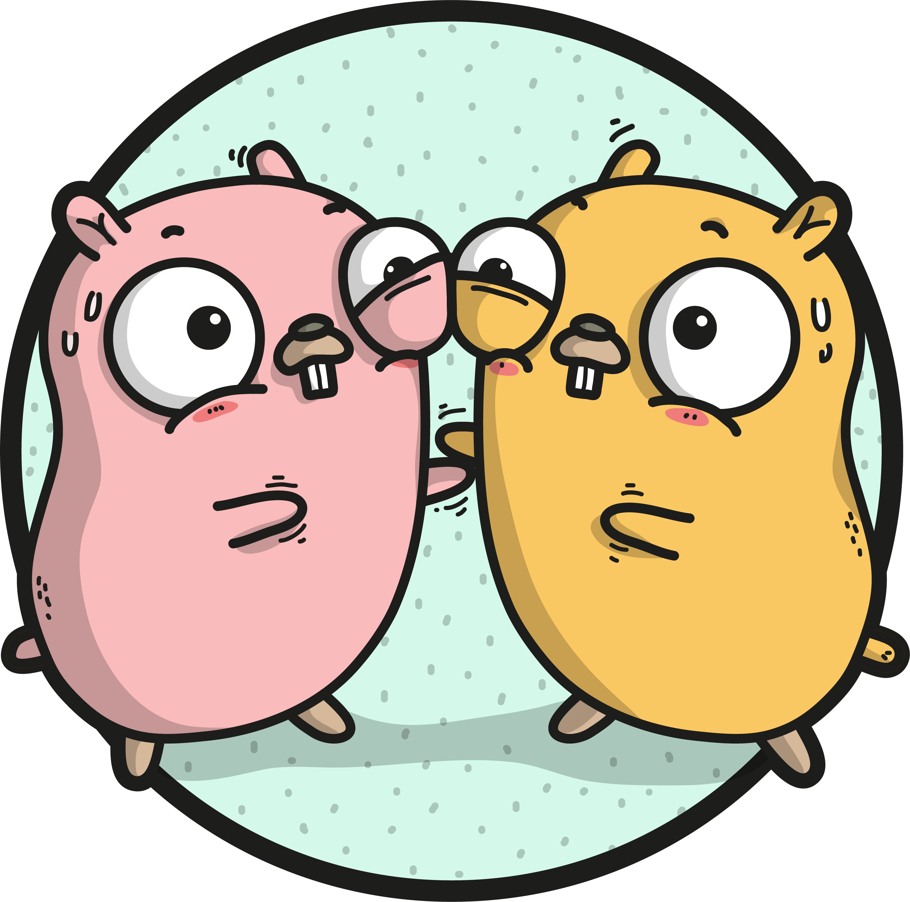

---

# Birthday Greetings Kata

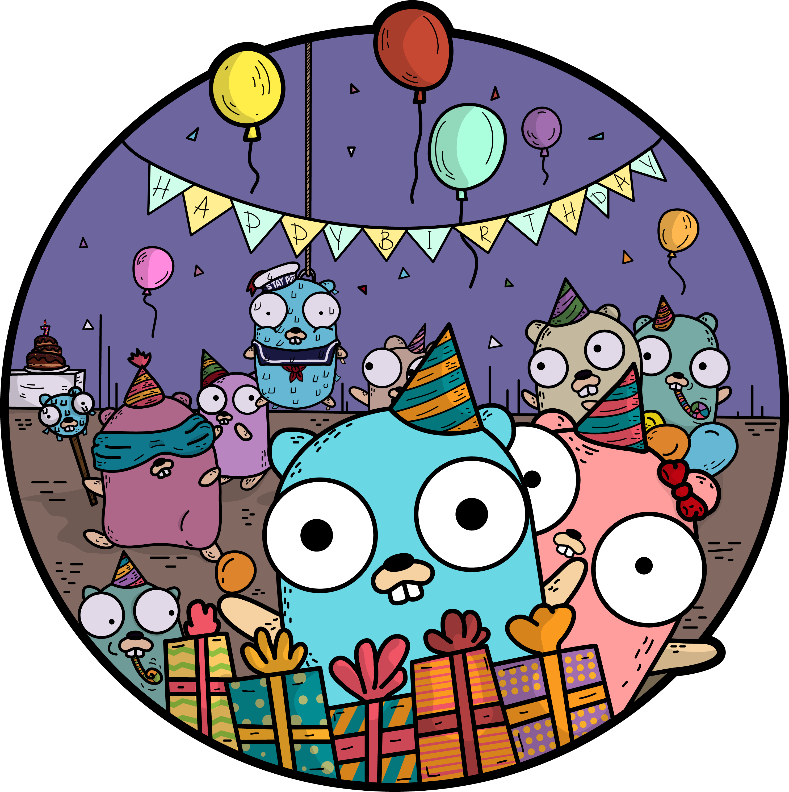

Goal: learn about hexagonal architecture

---

Problem:
**Write a program that...**

- Loads a set of employee records
- Sends a greetings email to all employees whose birthday is today

---

## Goal: refactor the code so that it is more...

- Testable: we can write unit tests (see definition next slide)
- Flexible:
  - It should not cost a lot to change when requirements change.
  - Business logic must not depend on low-level APIs
- Well-designed: separate clearly the business logic from the infrastructure.

---

### Unit tests

A test is not a unit test if:

    It talks to a database
    It communicates across the network
    It touches the file system
    You have to do things to your environment to run it (eg, change config files, comment lines)

A unit test tests a `unit` of code. Not necessarily a function.

<!-- 
Why unit tests?
- Shorten the feedback loop to check if business logic is not broken
 -->

---

# Not Goals!

- Make perfect code
- Have full coverage with unit tests
- Improve performances
- Change the logic of the service
  - But you can change the prototypes and interfaces

---

# Coding time

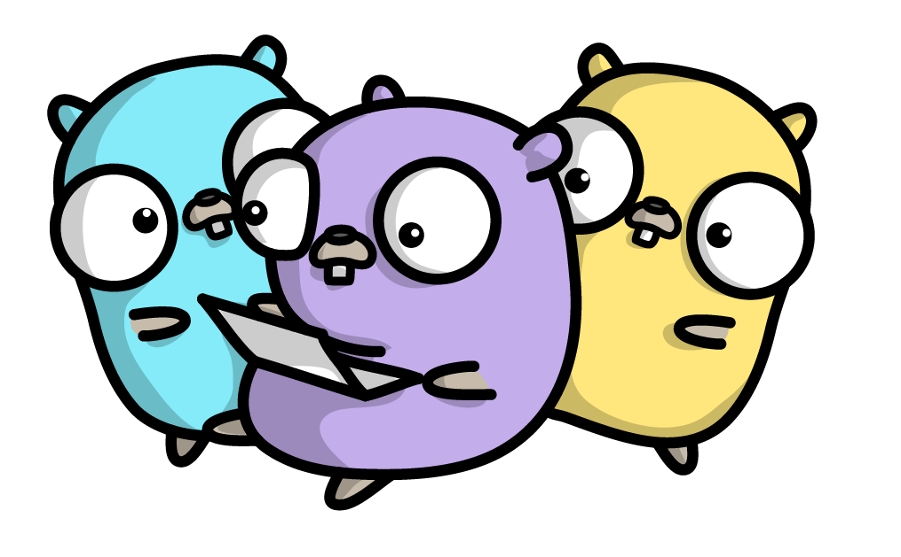

---

# Coding time

- Testable code
- Flexible code
- Easy to read, and well designed

---

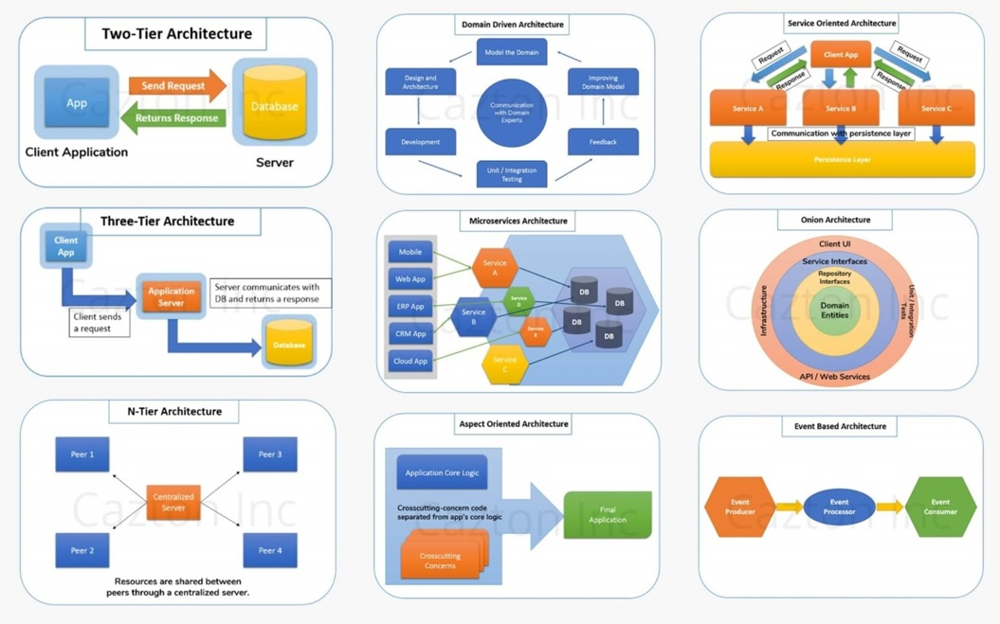

---

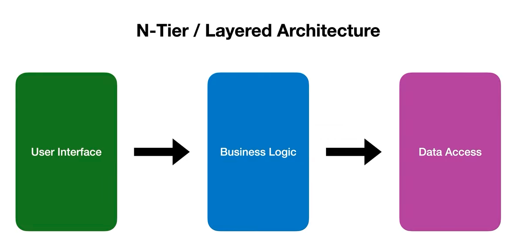

---

# Hexagonal Architecture

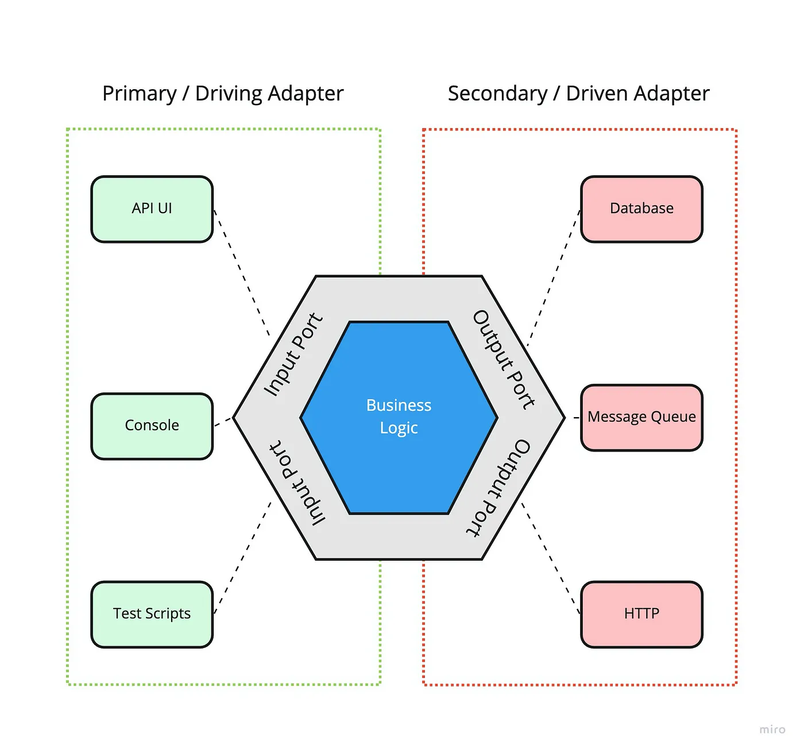

Alistair Cockburn (2005)

- Domain Model depends on nothing
- Everything depends on the domain model

<!-- 
This is not an hexagon (not 6 but multiple parts)
 -->

---

# Dependency Inversion Principle

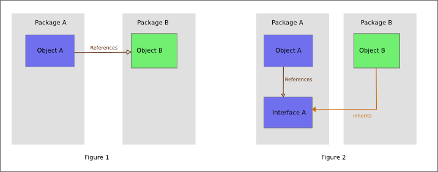

    High-level modules should not depend on low-level modules. Both should depend on abstractions.
    Abstractions should not depend on details. Details should depend on abstractions.

---

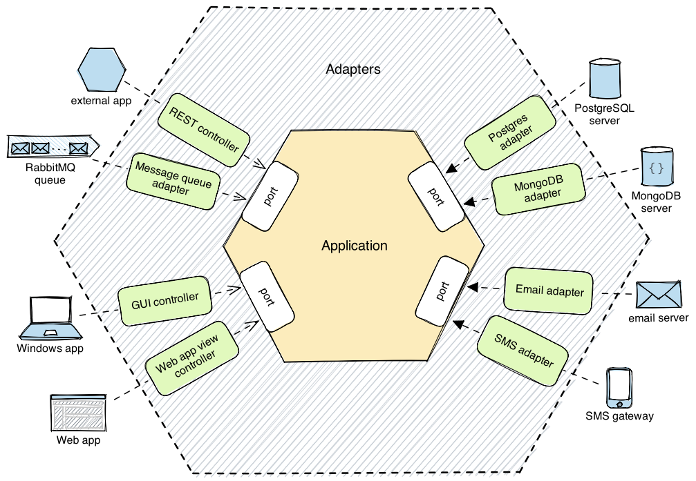

---

# Pros

- More testable code
- More explicit design
- Better separation of concerns. Isolate application logic.
- Switch technos easily (DB, mail provider...)
- Less risk with dependencies

---

# Cons

- A bit verbose
- Without an Inversion of Control framework, we may need some boilerplate code to pass the dependencies to the services
- More thinking to do when defining interfaces
  - Can be difficult when creating the dependency

--- 

# Tooling

---

# Back to the Kata

Refactoring the service

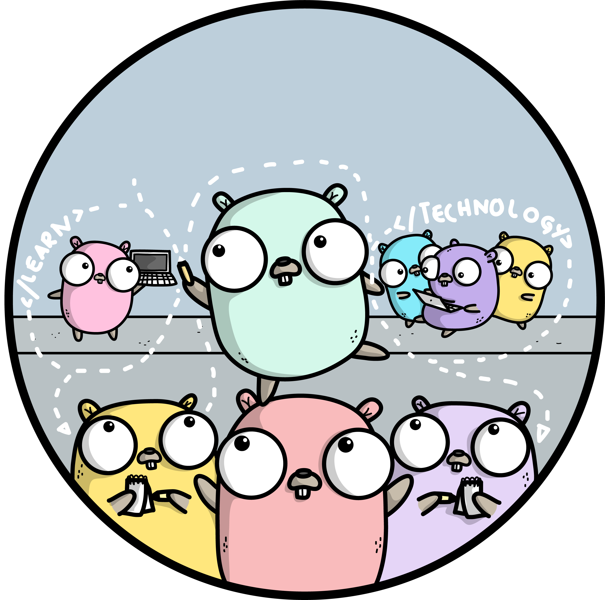

---

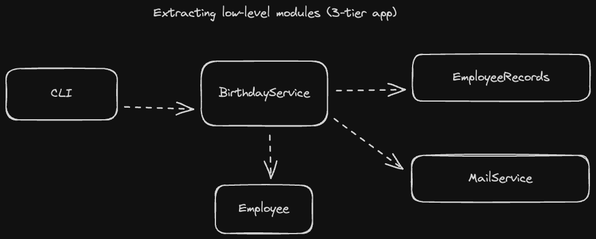

<!-- 
First step would be to extract the low-level modules: employee repo and mail service.
This creates an n-tier architecture
 -->

---

<!-- Second step -->
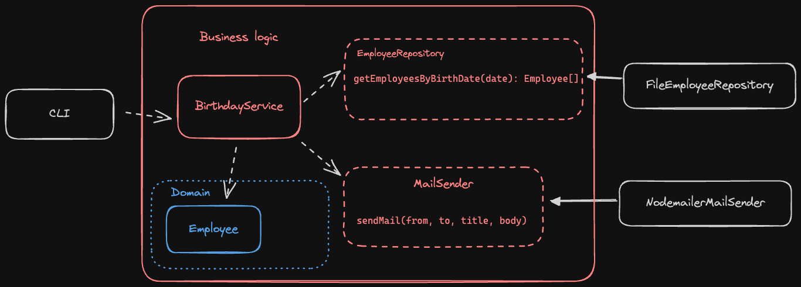

---

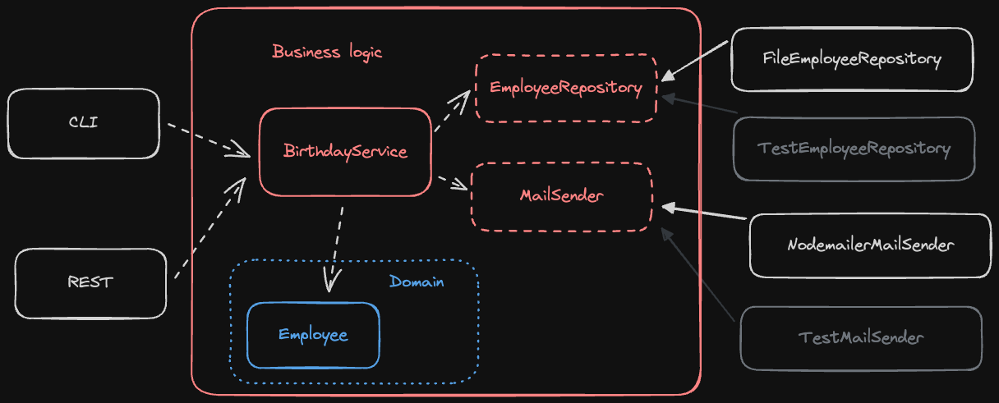

---

--- 

# Apply to our code?

---

# Important points

- Isolate business logic from the 'low-level' modules
- No dependencies in application core when possible
- Application core should at least call custom code, which manage the dependencies

---

 Clean architecture

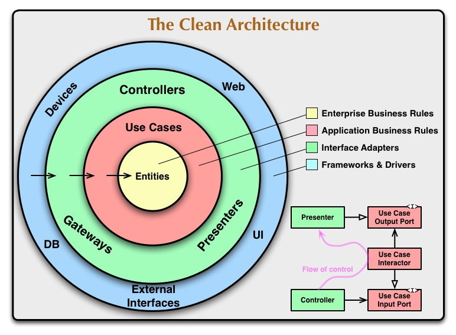

---

Onion architecture

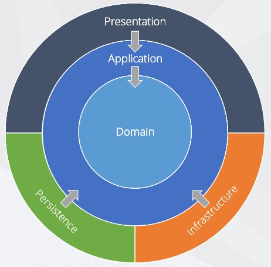

---

Inversion of Control:
 A framework calls the code

Dependency Inversion Principle
  Depend on interface, not implementation

Dependency Injection
  Give the dependency to the module

  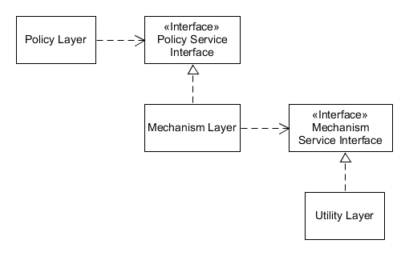
