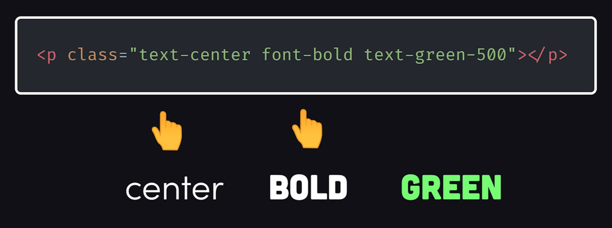
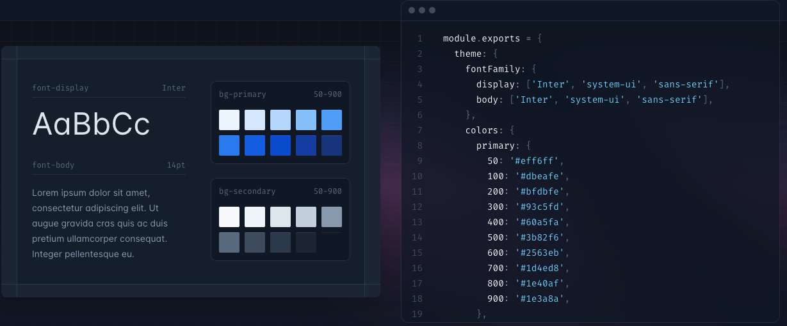
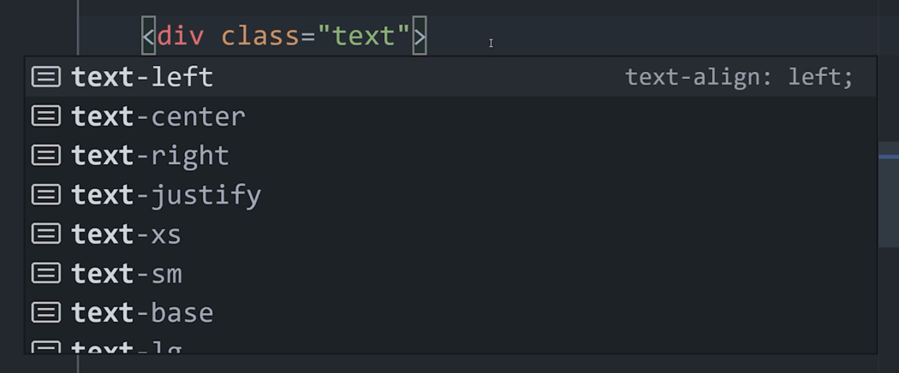
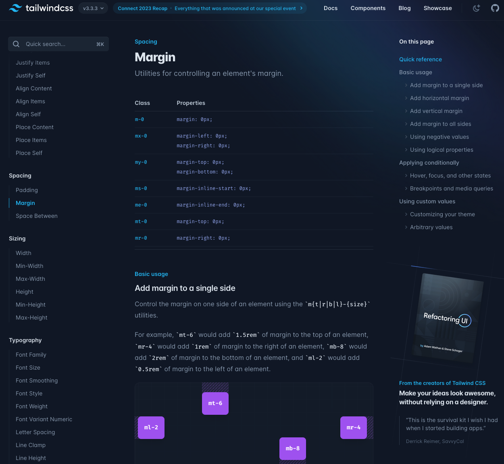

---

# What it is
Open source CSS framework

v1 in 2019

https://tailwindcss.com/

A package of pre-built CSS utility classes



---

# Tailwind is not Bootstrap
Different granularity

Bootstrap will give you fully styled high level components: Card, Button, ...

Tailwind classes are built around elements

--- 

# Classes

- Layout: flex, grid, ...
- Spacing: padding, margin, ...
- Sizing: width, height, ...
- Typography: color, style, font, ...
- Background, images, borders


---

# Variants
- Size: `sm:`, `md:`, `lg:`
- Mode: `dark:`, `light:`
- State: `hover:`

```
class="pb-10 sm:pb-12 md:pb-8 lg:pb-4"
```
---

# Themes



--- 
# Building the CSS
Tailwind generates CSS files that only contains the needed classes

---

# Tooling: VSCode plugin



---

# Documentation



---

# Pros and cons
## Pros
- Constrains styles to the design system
  - Better than Bootstrap if following a design
- Smaller CSS files
- No need to name CSS classes
- Nice for small or big projects
    - Easy to prototype designs
    - CSS and HTML in same place

---
## Cons
- Can make HTML components a bit verbose
	- Solution 1: create components
	- Solution 2: use `@apply` directive
- At first, you need to spend some time to learn all the available classes
- Can be a bit tricky to do dynamic styling (but may be better now)

--- 

# Showcase 

https://tailwindcss.com/showcase
